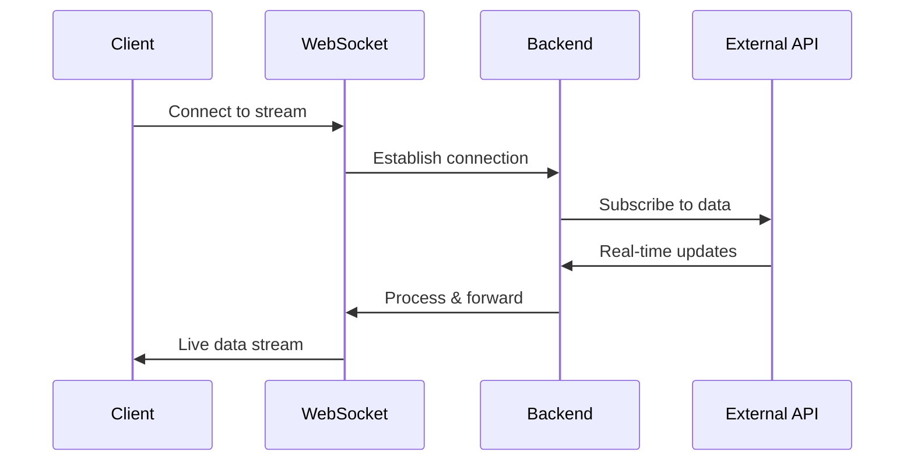
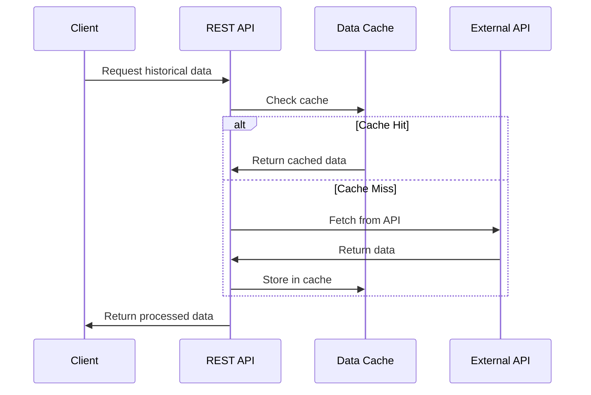

# NovaSignal Architecture Overview

This document provides a comprehensive overview of NovaSignal's system architecture, design patterns, and technical implementation.

## 🏗️ System Architecture

### High-Level Overview

```
┌─────────────────┐    ┌─────────────────┐    ┌─────────────────┐
│   Frontend      │    │   Backend       │    │  Data Sources   │
│                 │    │                 │    │                 │
│  React/Vite     │◄──►│  FastAPI        │◄──►│  Binance API    │
│  TradingView    │    │  WebSocket      │    │  Alpha Vantage  │
│  Charts         │    │  REST API       │    │  YFinance       │
└─────────────────┘    └─────────────────┘    └─────────────────┘
       │                        │                        │
       ▼                        ▼                        ▼
┌─────────────────┐    ┌─────────────────┐    ┌─────────────────┐
│  Browser APIs   │    │  Data Processing│    │  External APIs  │
│  Performance    │    │  Caching        │    │  Rate Limiting  │
│  LocalStorage   │    │  Transformations│    │  Error Handling │
└─────────────────┘    └─────────────────┘    └─────────────────┘
```

## 🎨 Frontend Architecture

### Technology Stack
- **React 18** - UI framework with hooks and concurrent features
- **Vite** - Build tool and development server
- **TradingView Lightweight Charts** - Professional chart library
- **Modern JavaScript (ES2022)** - Latest language features

### Component Structure

```
frontend/src/
├── components/           # Reusable UI components
│   ├── ErrorBoundary.jsx      # Error handling
│   ├── LoadingStates.jsx      # Loading animations
│   ├── MarketSelector.jsx     # Market selection
│   ├── SymbolSelector.jsx     # Symbol search
│   ├── TimeframeSelector.jsx  # Timeframe controls
│   ├── TechnicalIndicators.jsx # TA indicators
│   ├── TradingSignals.jsx     # Signal alerts
│   ├── NewsPanel.jsx          # News display
│   ├── DataExportPanel.jsx    # Export controls
│   └── ShortcutToast.jsx      # Notifications
├── hooks/               # Custom React hooks
│   ├── useWebSocket.js        # WebSocket management
│   ├── useSettings.js         # User preferences
│   ├── useAnalytics.js        # Event tracking
│   ├── useLogger.js           # Logging utilities
│   └── useKeyboardShortcuts.js # Keyboard handling
├── utils/               # Utility functions
│   ├── chartSpacingManager.js # Chart spacing system
│   ├── performanceMonitor.js  # Performance tracking
│   ├── dataTransforms.js      # Data processing
│   └── constants.js           # App constants
└── AppSimpleFixed.jsx   # Main application component
```

### State Management
- **React Hooks** - useState, useEffect, useCallback, useMemo
- **Local State** - Component-level state management
- **Context API** - Shared state for themes and settings
- **LocalStorage** - Persistent user preferences

### Performance Architecture

#### Chart Spacing System
```javascript
class ChartSpacingManager {
  constructor(config) {
    this.charts = new Map()
    this.config = config
    this.observer = new MutationObserver()
  }
  
  registerChart(id, instance, dataLength) {
    // Chart registration and spacing management
  }
  
  applySpacing(chartId, force = false) {
    // Dynamic spacing application
  }
}
```

#### Performance Monitoring
```javascript
const performanceMonitor = {
  measureFPS: () => requestAnimationFrame(callback),
  measureMemory: () => performance.memory,
  measureLatency: (startTime) => performance.now() - startTime,
  trackRenderTime: (component, startTime) => { /* timing */ }
}
```

## 🔧 Backend Architecture

### Technology Stack
- **FastAPI** - Modern Python web framework
- **Uvicorn** - ASGI server for async support
- **WebSockets** - Real-time data streaming
- **Asyncio** - Asynchronous programming
- **Pydantic** - Data validation and serialization

### Project Structure

```
backend/
├── main.py                 # Application entry point
├── routers/               # API route modules
│   ├── websocket.py       # WebSocket handlers
│   ├── history.py         # Historical data API
│   ├── indicators.py      # Technical indicators API
│   └── signals.py         # Trading signals API
├── connectors/            # Data provider connectors
│   ├── crypto_router.py   # Crypto data routing
│   ├── crypto_binance.py  # Binance integration
│   ├── stocks_router.py   # Stock data routing
│   ├── stocks_alpaca.py   # Alpaca integration
│   └── stocks_yfinance.py # YFinance integration
├── signals/               # Technical analysis
│   ├── indicators.py      # Indicator calculations
│   └── strategies.py      # Trading strategies
├── ml/                    # Machine learning
│   └── predictor.py       # Price prediction models
└── utils/                 # Utility modules
    ├── cache.py           # Data caching
    ├── rate_limiter.py    # API rate limiting
    └── logger.py          # Logging configuration
```

### API Design

#### REST Endpoints
```python
@app.get("/api/history")
async def get_historical_data(
    symbol: str,
    market: str = "crypto",
    interval: int = 1,
    days: int = 30,
    provider: str = "auto"
) -> HistoricalDataResponse
```

#### WebSocket Endpoints
```python
@app.websocket("/ws/crypto/ohlc")
async def websocket_crypto_endpoint(
    websocket: WebSocket,
    symbol: str,
    interval: int,
    provider: str = "auto"
)
```

### Data Flow Architecture

#### Request Flow
```
Client Request → FastAPI Router → Data Connector → External API → Data Transform → Client Response
```

#### WebSocket Flow
```
Client Connect → WebSocket Handler → Data Stream → Real-time Updates → Client Receive
```

#### Caching Layer
```python
class DataCache:
    def __init__(self, max_size=1000, ttl=300):
        self.cache = {}
        self.access_times = {}
        self.max_size = max_size
        self.ttl = ttl
    
    async def get(self, key):
        # LRU cache with TTL expiration
    
    async def set(self, key, value):
        # Cache management with eviction
```

## 🔄 Data Flow Patterns

### Real-Time Data Flow



### Historical Data Flow



## 🎯 Design Patterns

### Frontend Patterns

#### Custom Hooks Pattern
```javascript
function useWebSocket(url) {
  const [isConnected, setIsConnected] = useState(false)
  const [lastMessage, setLastMessage] = useState(null)
  
  const sendMessage = useCallback((message) => {
    // WebSocket message sending
  }, [])
  
  return { isConnected, lastMessage, sendMessage }
}
```

#### Error Boundary Pattern
```javascript
class ErrorBoundary extends React.Component {
  constructor(props) {
    super(props)
    this.state = { hasError: false, error: null }
  }
  
  static getDerivedStateFromError(error) {
    return { hasError: true, error }
  }
  
  componentDidCatch(error, errorInfo) {
    // Error logging and reporting
  }
}
```

#### Performance Monitoring Pattern
```javascript
function usePerformanceMonitor() {
  const [metrics, setMetrics] = useState({})
  
  const measureRenderTime = useCallback((label, fn) => {
    const start = performance.now()
    const result = fn()
    const end = performance.now()
    
    setMetrics(prev => ({
      ...prev,
      [label]: end - start
    }))
    
    return result
  }, [])
  
  return { metrics, measureRenderTime }
}
```

### Backend Patterns

#### Connector Pattern
```python
class DataConnector:
    async def fetch_historical_data(self, symbol, interval, days):
        raise NotImplementedError
    
    async def get_real_time_stream(self, symbol, interval):
        raise NotImplementedError

class BinanceConnector(DataConnector):
    async def fetch_historical_data(self, symbol, interval, days):
        # Binance-specific implementation
```

#### Factory Pattern
```python
class ConnectorFactory:
    @staticmethod
    def create_connector(provider_type: str) -> DataConnector:
        if provider_type == "binance":
            return BinanceConnector()
        elif provider_type == "alpaca":
            return AlpacaConnector()
        else:
            raise ValueError(f"Unknown provider: {provider_type}")
```

#### Observer Pattern (WebSocket)
```python
class WebSocketManager:
    def __init__(self):
        self.connections = set()
    
    async def add_connection(self, websocket):
        self.connections.add(websocket)
    
    async def broadcast(self, message):
        for connection in self.connections:
            await connection.send_text(message)
```

## 🔐 Security Architecture

### Frontend Security
- **Content Security Policy** - XSS protection
- **HTTPS Only** - Secure data transmission
- **Input Validation** - Client-side data validation
- **Error Boundaries** - Graceful error handling

### Backend Security
- **CORS Configuration** - Cross-origin request control
- **Rate Limiting** - API abuse prevention
- **Input Validation** - Pydantic model validation
- **Error Handling** - Secure error responses

### API Security
- **API Key Management** - Secure credential storage
- **Request Signing** - Authentication for external APIs
- **Rate Limiting** - Prevent API abuse
- **Circuit Breaker** - Failover protection

## 📊 Performance Architecture

### Frontend Performance

#### Chart Optimization
```javascript
const chartConfig = {
  // Optimized for performance
  baseSpacing: 35,
  minSpacing: 20,
  maxSpacing: 60,
  rightOffset: 30,
  autoResize: true,
  
  // Performance settings
  maxDataPoints: 1000,
  updateThrottle: 100,
  renderThrottle: 16 // 60fps target
}
```

#### Memory Management
```javascript
function useMemoryOptimizedData(data) {
  return useMemo(() => {
    // Data processing with memory optimization
    return data.slice(-MAX_DATA_POINTS)
  }, [data])
}
```

### Backend Performance

#### Async Processing
```python
async def process_multiple_symbols(symbols):
    tasks = [fetch_symbol_data(symbol) for symbol in symbols]
    results = await asyncio.gather(*tasks, return_exceptions=True)
    return results
```

#### Caching Strategy
```python
# Multi-level caching
@lru_cache(maxsize=128)
def calculate_indicators(data_hash):
    # Expensive calculations cached

# Redis for distributed caching
await redis.setex(cache_key, ttl, json.dumps(data))
```

## 🧪 Testing Architecture

### Frontend Testing
- **Unit Tests** - Component testing with Jest
- **Integration Tests** - Hook and utility testing
- **E2E Tests** - User workflow testing
- **Performance Tests** - Rendering and memory tests

### Backend Testing
- **Unit Tests** - Individual function testing
- **Integration Tests** - API endpoint testing
- **Load Tests** - Performance under load
- **WebSocket Tests** - Real-time functionality

## 🚀 Deployment Architecture

### Development Environment
```yaml
services:
  backend:
    build: ./backend
    ports: ["8000:8000"]
    environment:
      - ENV=development
  
  frontend:
    build: ./frontend
    ports: ["3003:3003"]
    depends_on: [backend]
```

### Production Environment
```yaml
services:
  backend:
    image: novasignal-backend:latest
    environment:
      - ENV=production
      - LOG_LEVEL=INFO
    healthcheck:
      test: ["CMD", "curl", "-f", "http://localhost:8000/health"]
  
  frontend:
    image: novasignal-frontend:latest
    environment:
      - NODE_ENV=production
```

## 📈 Scalability Considerations

### Horizontal Scaling
- **Load Balancing** - Multiple backend instances
- **Database Sharding** - Distributed data storage
- **CDN Integration** - Static asset delivery
- **Microservices** - Service decomposition

### Vertical Scaling
- **Resource Optimization** - CPU and memory tuning
- **Caching Layers** - Redis and in-memory caching
- **Database Optimization** - Query optimization
- **Connection Pooling** - Efficient resource usage

## 🔧 Configuration Management

### Environment Configuration
```python
class Settings(BaseSettings):
    environment: str = "development"
    log_level: str = "INFO"
    
    # API Keys
    binance_api_key: Optional[str] = None
    alpha_vantage_key: Optional[str] = None
    
    # Performance
    max_connections: int = 100
    cache_ttl: int = 300
    
    class Config:
        env_file = ".env"
```

### Feature Flags
```javascript
const featureFlags = {
  performanceMonitoring: true,
  advancedIndicators: true,
  exportFeatures: true,
  debugMode: process.env.NODE_ENV === 'development'
}
```

This architecture ensures NovaSignal is scalable, maintainable, and performant while providing a solid foundation for future enhancements.